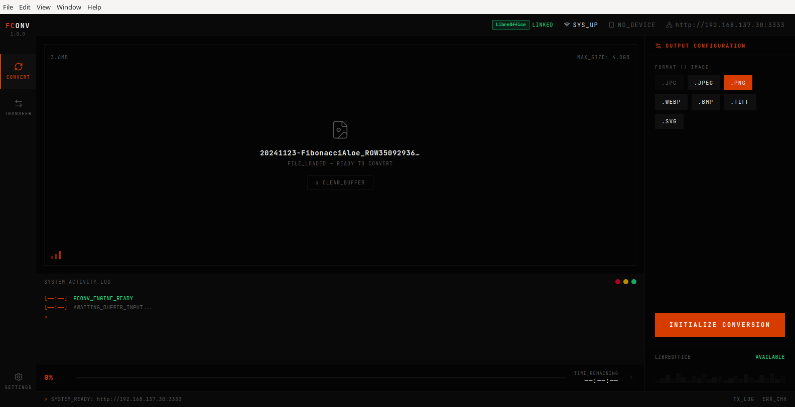
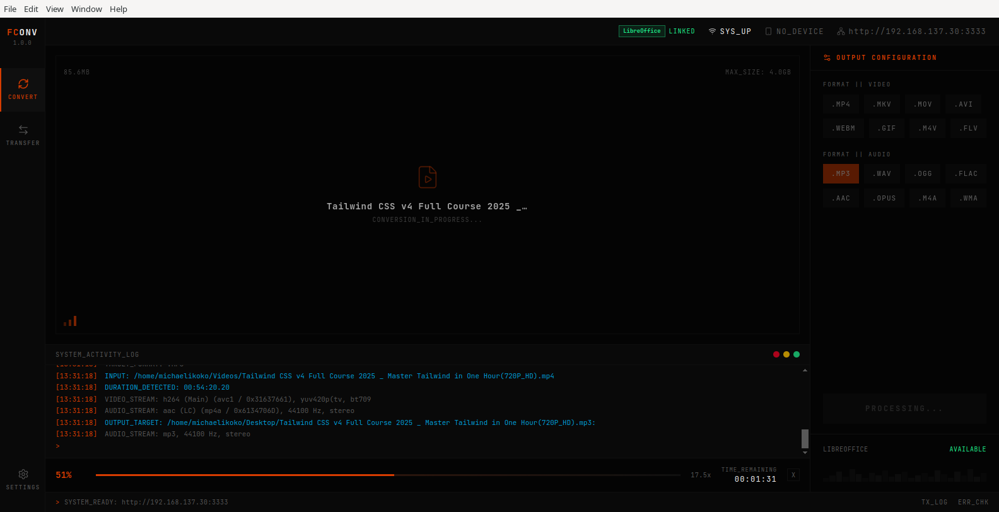
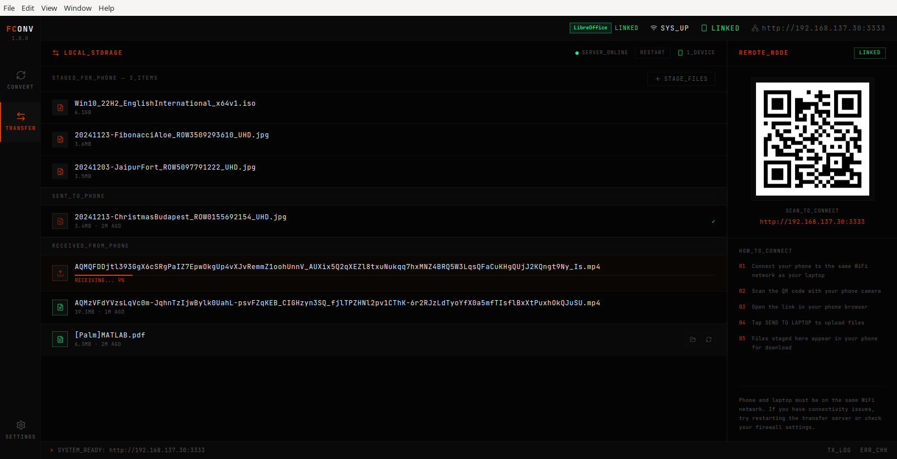
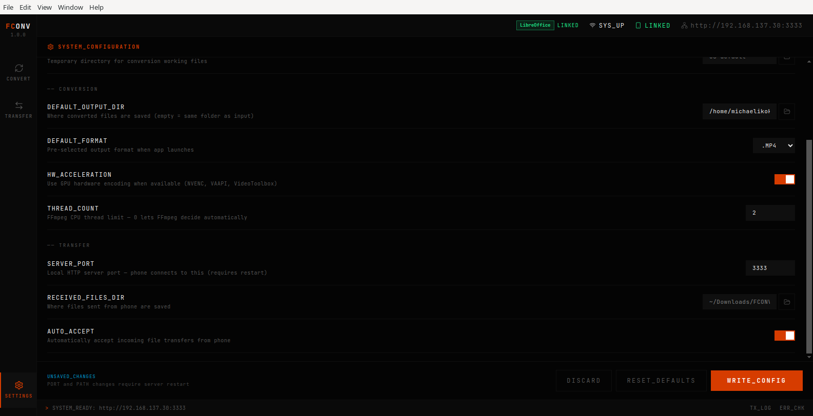
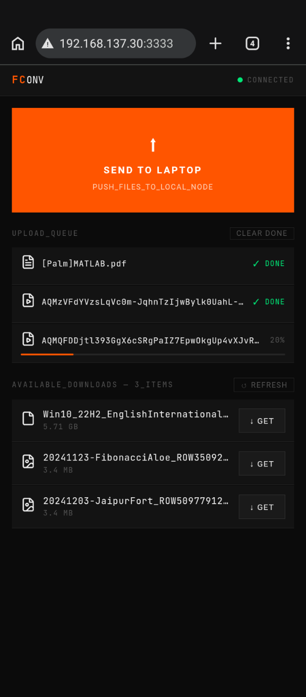

# FCONV

> Local file conversion and phone-to-laptop transfer. No cloud. No accounts. No internet required.



---

## What is FCONV?

FCONV is a desktop application for converting files and transferring them between your phone and laptop — entirely over your local WiFi network. Nothing leaves your machine.

- **Convert** videos, audio, images, and documents between formats
- **Transfer** files from your phone to your laptop and back by scanning a QR code
- **No cloud**, no accounts, no file size limits imposed by a third-party service

---

## Features

### File Conversion
- Video: MP4, MKV, MOV, AVI, WEBM and more
- Audio: MP3, WAV, FLAC, AAC, OGG and more
- Image: JPG, PNG, WEBP, BMP and more
- Documents: PDF, DOCX, ODT, XLSX, PPTX and more *(requires LibreOffice)*

### Phone ↔ Laptop Transfer
- Scan a QR code on your phone to connect instantly
- Send files from your phone to your laptop
- Download files staged on your laptop to your phone
- Live upload progress indicator on desktop
- Works on any phone browser — no app install required

### Settings
- Configurable output directory, default format, thread count
- Hardware acceleration toggle
- Customisable received files directory

---

## Screenshots

| Convert | Transfer | Settings | Mobile UI |
|---------|----------|----------| --------- |
|  |  |  | 

---

## Download

Go to the [Releases](https://github.com/michaelikoko/fconv/releases) page and download the file for your platform:

| Platform | File |
|----------|------|
| Linux    | `FCONV-Linux-x.x.x.AppImage` |
| Windows  | `FCONV-Windows-x.x.x-Setup.exe` |

### Linux
```bash
chmod +x FCONV-Linux-1.0.0.AppImage
./FCONV-Linux-1.0.0.AppImage
```

### Windows
Run the `.exe` installer and follow the prompts.

### macOS
macOS builds are not currently available. If you are a macOS developer and want to help, see [Contributing](#contributing).

---

## Requirements

### All platforms
- Your phone and laptop must be on the **same WiFi network** for file transfer

### Document conversion
Document conversion (PDF, DOCX, ODT, XLSX, PPTX etc.) requires **LibreOffice** to be installed:

- **Ubuntu/Debian:** `sudo apt install libreoffice`
- **Fedora:** `sudo dnf install libreoffice`
- **Arch:** `sudo pacman -S libreoffice-fresh`
- **Windows/macOS:** [libreoffice.org/download](https://www.libreoffice.org/download/download-libreoffice/)

FCONV detects LibreOffice automatically. If it is not installed, the app will show a warning and document formats will be disabled.

---

## Building from source

### Prerequisites
- Node.js 18+
- npm
- FFmpeg static binaries (see below)

### Clone and install
```bash
git clone https://github.com/michaelikoko/fconv.git
cd fconv
npm install
```

### FFmpeg binaries
FFmpeg is not included in the repository due to file size. Download static builds and place them in `resources/ffmpeg/`:

| File | Source |
|------|--------|
| `ffmpeg-linux` | [johnvansickle.com/ffmpeg](https://johnvansickle.com/ffmpeg/) — grab the `amd64-static` build |
| `ffmpeg-win.exe` | [github.com/BtbN/FFmpeg-Builds](https://github.com/BtbN/FFmpeg-Builds/releases) — grab `ffmpeg-master-latest-win64-gpl.zip`, take `bin/ffmpeg.exe` |
| `ffmpeg-mac` | [evermeet.cx/ffmpeg](https://evermeet.cx/ffmpeg/) |

```bash
chmod +x resources/ffmpeg/ffmpeg-linux
chmod +x resources/ffmpeg/ffmpeg-mac
```

### Run in development
```bash
# Desktop app
npm run dev

# Phone UI (in a separate terminal)
npm run dev:phone
```

### Build
```bash
# Build phone UI first
npm run build:phone

# Then build for your platform
npm run build:linux   # on Linux
npm run build:win     # on Windows
npm run build:mac     # on macOS
```

Output is placed in `release/<version>/`.

---

## Project structure

```
fconv/
├── electron/           # Main process (Node.js)
│   ├── ipc/            # IPC handlers (convert, transfer, settings, files)
│   └── utils/          # FFmpeg, LibreOffice, settings utilities
├── src/                # Renderer process (React)
│   ├── components/     # UI components
│   ├── hooks/          # IPC event hooks
│   ├── pages/          # Page components
│   ├── store/          # Zustand state stores
│   └── utils/          # File type detection, formatting
├── phone-ui/           # Phone PWA (React, served by Express)
├── shared/             # Types and constants shared between main and renderer
└── resources/
    └── ffmpeg/         # FFmpeg binaries (not committed — download separately)
```

---

## Contributing

Contributions are welcome. FCONV is built with Electron, React, TypeScript, and Tailwind/DaisyUI.

### Getting started
1. Fork the repository
2. Create a branch: `git checkout -b feature/your-feature`
3. Make your changes
4. Open a pull request

### Areas that need help
- **macOS build and testing** — no Mac available for testing
- **Bug reports** — open an issue with your OS, app version, and steps to reproduce
- **Document conversion filters** — additional LibreOffice filter mappings
- **UI improvements** — the design system is established, component additions are welcome

### Issues
Use [GitHub Issues](https://github.com/michaelikoko/fconv/issues) for bug reports and feature requests. Please check existing issues before opening a new one.

---

## Tech stack

| Layer | Technology |
|-------|-----------|
| Desktop shell | Electron |
| UI framework | React + TypeScript |
| Styling | Tailwind CSS + DaisyUI |
| State | Zustand |
| Routing | React Router |
| File conversion | FFmpeg (media), LibreOffice (documents) |
| Phone transfer | Express HTTP server + SSE |
| Phone UI | React PWA |
| Build | electron-builder, Vite |

---

## License

MIT — see [LICENSE](LICENSE) for details.

---

## Author

Michael Ikoko — [github.com/michaelikoko](https://github.com/michaelikoko)